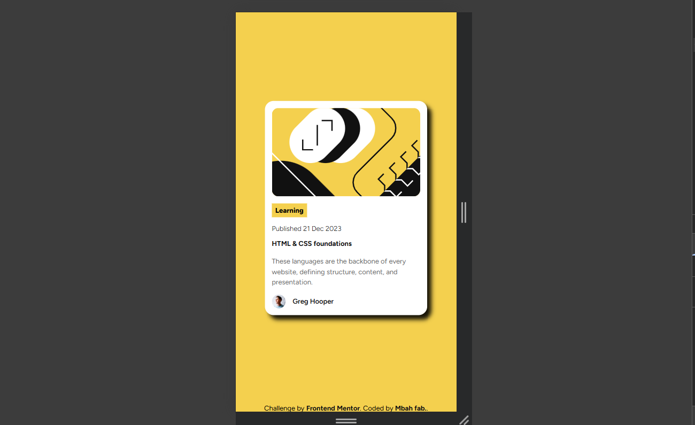
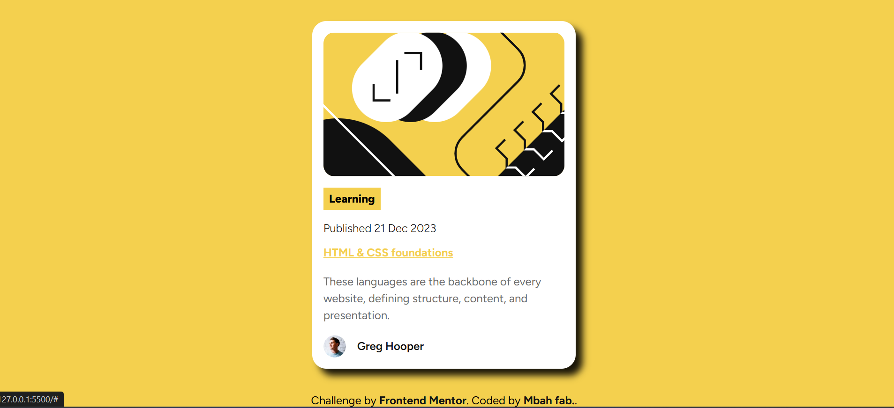

# Frontend Mentor - Blog preview card solution

This is a solution to the [Blog preview card challenge on Frontend Mentor](https://www.frontendmentor.io/challenges/blog-preview-card-ckPaj01IcS).

## Table of contents

- [Overview](#overview)
  - [The challenge](#the-challenge)
  - [Screenshot](#screenshot)
  - [Links](#links)
- [My process](#my-process)
  - [Built with](#built-with)
  - [What I learned](#what-i-learned)
  - [Continued development](#continued-development)
  - [AI Collaboration](#ai-collaboration)
- [Author](#author)
- [Acknowledgments](#acknowledgments)

## Overview

### The challenge

This is my solution to the Blog preview card challenge from frontend mentor.
I built the project using HTML and CSS and used the provided assets like stlye, active-states guide as reference.

### Screenshot

### Links

- Solution URL: [Solution URL](https://github.com/mbah-create/mbah-create-blog-card-preview)
- Live Site URL: [Live site URL](https://https://mbah-create.github.io/mbah-create-blog-card-preview/)

## My process

### Built with

- Semantic HTML5 markup
- CSS3
- CSS variables
- pseudo-class
- Flexbox
- @media query
- Responsive design
- I work with meaning and structure.Content order match the design.
- Google fonts (outfits).

### What I learned

This is my second challenge with frontend mentor and my second project as i navigate my path in web dev. This challenge introduce to so many CSS and techniques that i can reapply as move forward.

- hover and focus states for interactive elements.
- how to use pseudo-class (:root) to store CSS variables.
- box-shaddow.

### Continued development

- hover effects.
- @media query.
- to read and understand designs without back and forth checking.

### AI Collaboration

I used chatgpt as a collaborator and as a learning assitant throughout this project.
Rather than asking it to genertae the solutions and give me blogs of code,i used it to undertand HTML and CSS concepts.The expalaination helped me understand why certain techniques were used so that i could implement it in my own words and understand the process.

## Author

- Website - [mbah fab..](https://www.your-site.com)
- Frontend Mentor - [@mbah-create](https://www.frontendmentor.io/profile/yourusername)
- Twitter - [@alreadywon100](https://www.twitter.com/yourusername)

## Acknowledgments

my self. I have a long way to go in web dev but whats is important is that i started.
